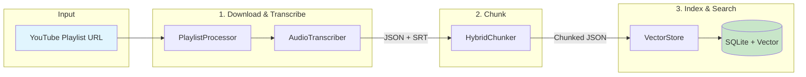

# Chat with YouTube Playlist

A RAG (Retrieval-Augmented Generation) pipeline to download, transcribe, chunk, and semantically search YouTube playlists using Google's Gemini AI. Enables Q&A over video content with direct timestamp links.

## Pipeline Architecture



### Data Flow

| Stage | Script | Input | Output |
|-------|--------|-------|--------|
| 1 | [playlist_processor](src/ingestion/playlist_processor.md) | Playlist URL | CSV progress + triggers transcriber |
| 2 | [audio_transcriber](src/ingestion/audio_transcriber.md) | Video URL | JSON transcription + SRT subtitles |
| 3 | [chunker](src/ingestion/chunker.md) | JSON transcription | Chunked JSON (parent + child chunks) |
| 4 | [vector_store](src/ingestion/vector_store.md) | Chunked JSON | SQLite vector database |

### Key Features

- **Resumable Processing**: CSV tracks progress, skip already-processed videos
- **Cost Tracking**: Token counts and USD estimates for Gemini API usage
- **Two-Tier Chunks**: Child chunks (128-256 tokens) for search, parent chunks (512-1000 tokens) for LLM context
- **Semantic Boundaries**: Hybrid detection using embeddings + temporal pauses
- **Direct Links**: YouTube URLs with timestamp for each chunk

## Prerequisites

- Python 3.11+
- [uv](https://docs.astral.sh/uv/) package manager
- Google API key with Gemini access

## Setup

```bash
# Install dependencies
uv sync

# Set your Google API key
export GOOGLE_API_KEY="your-api-key"
```

## Technologies

| Library | Purpose |
|---------|---------|
| google-genai | Audio transcription and embeddings via Gemini API |
| yt-dlp | YouTube audio download and metadata extraction |
| sqliteai-vector | SQLite vector extension for similarity search |
| numpy | Vector operations for embeddings |

## Available Scripts

### Playlist Processor

Download and transcribe entire YouTube playlists with progress tracking.

```bash
# Process a playlist (max 20 videos by default)
python -m src.ingestion.playlist_processor --playlist "https://www.youtube.com/playlist?list=..."

# Resume from existing progress file
python -m src.ingestion.playlist_processor --csv data/playlist_progress.csv

# Process more videos
python -m src.ingestion.playlist_processor --csv data/playlist_progress.csv --max-videos 50
```

Key options: `--playlist`, `--csv`, `--max-videos`, `--delete-audio`

### Audio Transcriber

Transcribe a single YouTube video with timestamps.

```bash
python -m src.ingestion.audio_transcriber --url "https://www.youtube.com/watch?v=..."
```

Key options: `--url`, `--model` (default: gemini-2.5-flash), `--delete-audio`

### Chunker

Semantically chunk transcripts using hybrid boundary detection (semantic similarity + temporal gaps).

```bash
# Chunk a single transcript
python -m src.ingestion.chunker --input data/audio/video.json --output-dir data/chunks/

# Batch process all transcripts
python -m src.ingestion.chunker --batch --input-dir data/audio/ --output-dir data/chunks/
```

Key options: `--input`, `--batch`, `--input-dir`, `--output-dir`

### Vector Store

Store chunks in SQLite vector database and perform semantic search.

```bash
# Ingest chunks into database
python -m src.ingestion.vector_store ingest --input-dir data/chunks/

# Search for content
python -m src.ingestion.vector_store search "your query" -k 5 --with-context

# View database stats
python -m src.ingestion.vector_store stats

# List all indexed videos
python -m src.ingestion.vector_store list
```

Key subcommands: `ingest`, `search`, `stats`, `list`, `delete`

## Quick Start

1. **Process playlist** - Download and transcribe videos:
   ```bash
   python -m src.ingestion.playlist_processor --playlist "https://www.youtube.com/playlist?list=..." --max-videos 5
   ```

2. **Chunk transcripts** - Prepare for semantic search:
   ```bash
   python -m src.ingestion.chunker --batch --input-dir data/audio/ --output-dir data/chunks/
   ```

3. **Build vector store** - Index chunks for retrieval:
   ```bash
   python -m src.ingestion.vector_store ingest --input-dir data/chunks/
   ```

4. **Search** - Query your playlist content:
   ```bash
   python -m src.ingestion.vector_store search "what is discussed about X?" -k 5 --with-context
   ```
