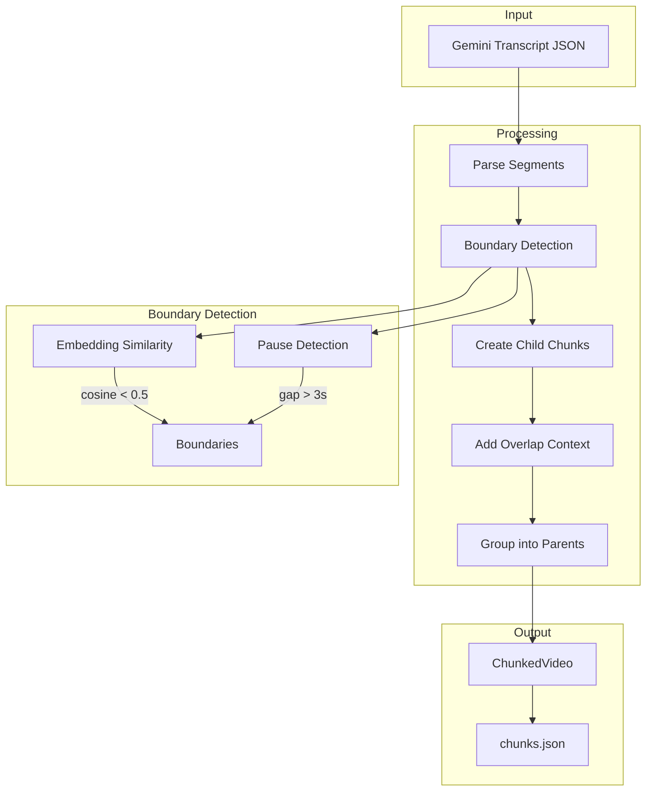
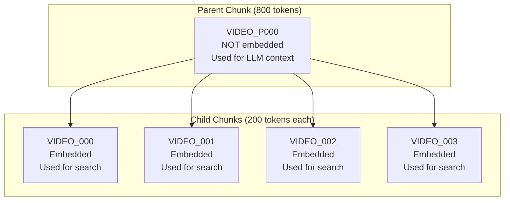
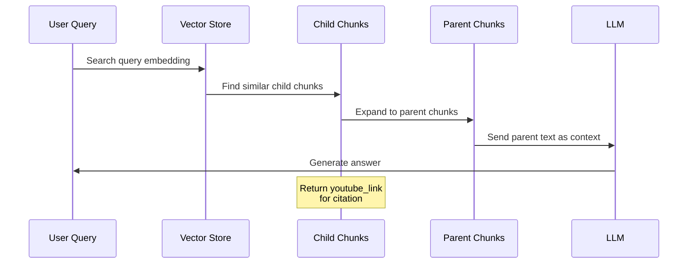
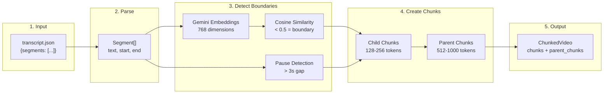
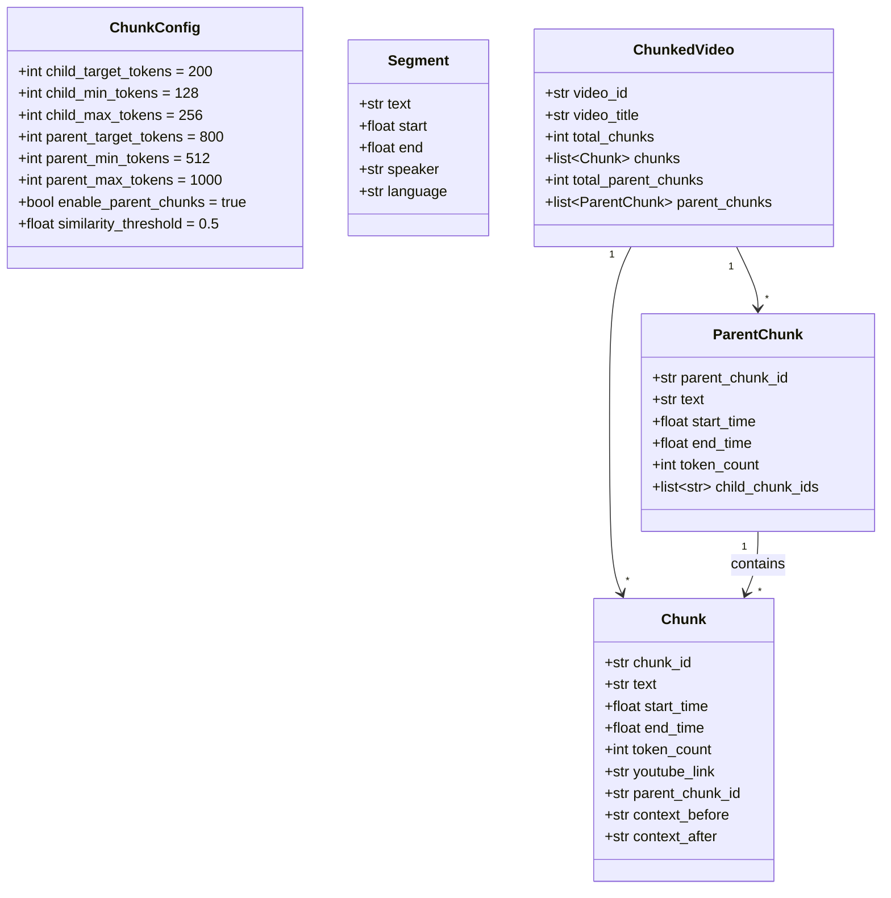
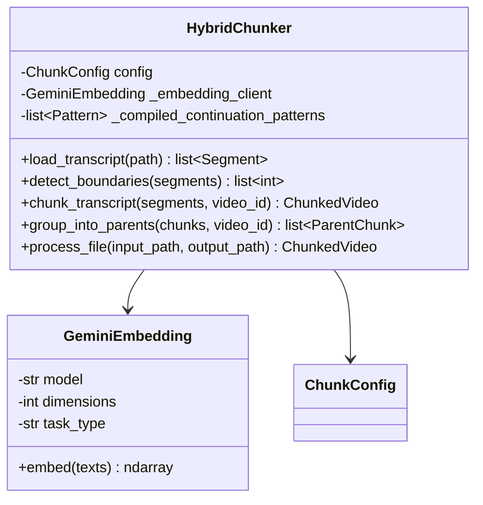
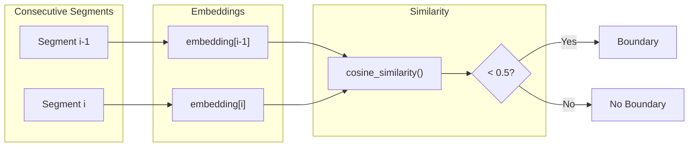
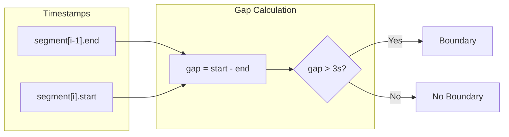
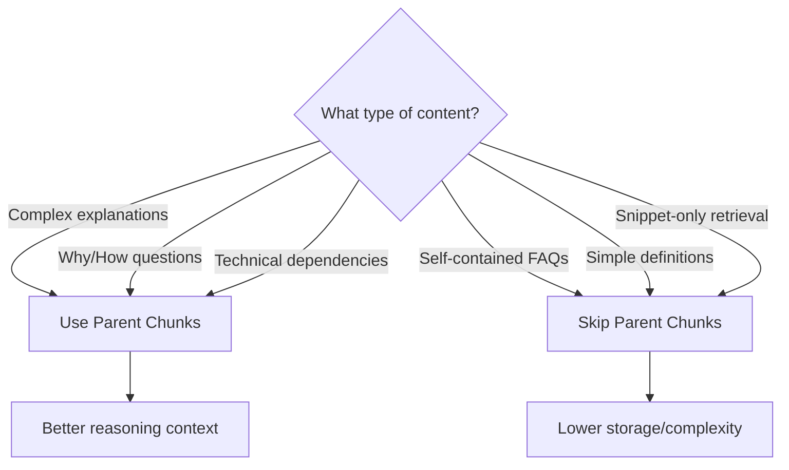

# Hybrid Chunker for YouTube Transcripts

A semantic chunking system optimized for RAG (Retrieval-Augmented Generation) pipelines. It processes YouTube video transcriptions and creates hierarchical chunks with parent-child relationships for improved retrieval quality.

## Architecture Overview



## Parent-Child Hierarchy

The chunker implements a two-level hierarchy optimized for RAG:



| Layer | Token Range | Purpose | Embedded? |
|-------|-------------|---------|-----------|
| **Parent** | 512-1000 | LLM context expansion | No |
| **Child** | 128-256 | Vector search | Yes |

## RAG Retrieval Workflow



## Data Flow



## Core Components

### Data Classes



### HybridChunker Class



## Boundary Detection

The chunker uses two complementary signals to detect natural chunk boundaries:

### 1. Semantic Boundaries (Embedding-based)



### 2. Temporal Boundaries (Pause-based)



## Chunking Algorithm

```mermaid
flowchart TD
    START([Start]) --> LOAD[Load transcript segments]
    LOAD --> DETECT[Detect boundaries<br/>embeddings + pauses]
    DETECT --> INIT[Initialize: chunks=[], tokens=0]

    INIT --> LOOP{For each segment}

    LOOP --> CHECK{Would exceed<br/>max tokens?}

    CHECK -->|Yes| MIN{tokens >= min?}
    MIN -->|Yes| CONT{Is continuation<br/>pattern?}
    CONT -->|Yes| HARD{tokens <= hard_max?}
    HARD -->|Yes| ADD[Add to current chunk]
    HARD -->|No| SPLIT[Create chunk, reset]
    CONT -->|No| SPLIT
    MIN -->|No| ADD

    CHECK -->|No| TARGET{tokens >= target<br/>AND at boundary?}
    TARGET -->|Yes| SPLIT
    TARGET -->|No| ADD

    ADD --> LOOP
    SPLIT --> LOOP

    LOOP -->|Done| OVERLAP[Add overlap context]
    OVERLAP --> PARENT{Parent chunks<br/>enabled?}
    PARENT -->|Yes| GROUP[Group into parents]
    PARENT -->|No| OUTPUT
    GROUP --> OUTPUT[Return ChunkedVideo]
    OUTPUT --> END([End])
```

## Continuation Patterns

The chunker recognizes linguistic patterns that indicate a segment should stay with the previous chunk:

| Category | Patterns (EN/FR) |
|----------|-----------------|
| Examples | "For example", "Par exemple", "For instance" |
| Clarification | "That is", "C'est-à-dire", "In other words" |
| Consequence | "So", "Donc", "Therefore", "Thus" |
| Addition | "And", "Et", "Furthermore", "De plus" |
| Contrast | "But", "Mais", "However", "Cependant" |
| Reference | "This", "Cette", "Which", "Ce qui" |
| Lists | "Second", "Deuxièmement", "1.", "2." |

## Output JSON Structure

```json
{
  "video_id": "abc123",
  "video_title": "Introduction to RAG",
  "total_chunks": 20,
  "total_parent_chunks": 5,
  "parent_chunks": [
    {
      "parent_chunk_id": "abc123_P000",
      "parent_index": 0,
      "text": "Combined text from all children (~800 tokens)...",
      "start_time": 0.0,
      "end_time": 120.5,
      "token_count": 812,
      "child_chunk_ids": ["abc123_000", "abc123_001", "abc123_002", "abc123_003"]
    }
  ],
  "chunks": [
    {
      "chunk_id": "abc123_000",
      "chunk_index": 0,
      "text": "Individual chunk text (~200 tokens)...",
      "start_time": 0.0,
      "end_time": 30.2,
      "token_count": 195,
      "youtube_link": "https://youtube.com/watch?v=abc123&t=0",
      "parent_chunk_id": "abc123_P000",
      "context_before": "",
      "context_after": "...last 50 tokens of next chunk..."
    }
  ]
}
```

## CLI Usage

```bash
# Process single file (with parent chunks - default)
uv run python -m src.ingestion.chunker \
  --input data/audio/video.json \
  --output-dir data/chunks/

# Process single file (without parent chunks)
uv run python -m src.ingestion.chunker \
  --input data/audio/video.json \
  --no-parent-chunks

# Batch process all transcripts
uv run python -m src.ingestion.chunker \
  --batch \
  --input-dir data/audio/ \
  --output-dir data/chunks/

# Custom token settings
uv run python -m src.ingestion.chunker \
  --input data/audio/video.json \
  --child-target-tokens 150 \
  --child-max-tokens 200 \
  --parent-target-tokens 600 \
  --parent-max-tokens 800
```

## Configuration Reference

| Parameter | Default | Description |
|-----------|---------|-------------|
| `child_target_tokens` | 200 | Target size for child chunks |
| `child_min_tokens` | 128 | Minimum child chunk size |
| `child_max_tokens` | 256 | Maximum child chunk size |
| `child_hard_max_tokens` | 300 | Hard max (for continuations) |
| `parent_target_tokens` | 800 | Target size for parent chunks |
| `parent_min_tokens` | 512 | Minimum parent chunk size |
| `parent_max_tokens` | 1000 | Maximum parent chunk size |
| `enable_parent_chunks` | true | Enable parent chunk generation |
| `overlap_tokens` | 50 | Context overlap between chunks |
| `pause_threshold_seconds` | 3.0 | Gap duration for pause boundary |
| `similarity_threshold` | 0.5 | Cosine similarity for boundary |
| `embedding_model` | gemini-embedding-001 | Embedding model |
| `embedding_dimensions` | 768 | Embedding vector dimensions |

## When to Use Parent Chunks



## Dependencies

- `google-genai` - Gemini API for embeddings
- `numpy` - Vector operations
- Python 3.11+
