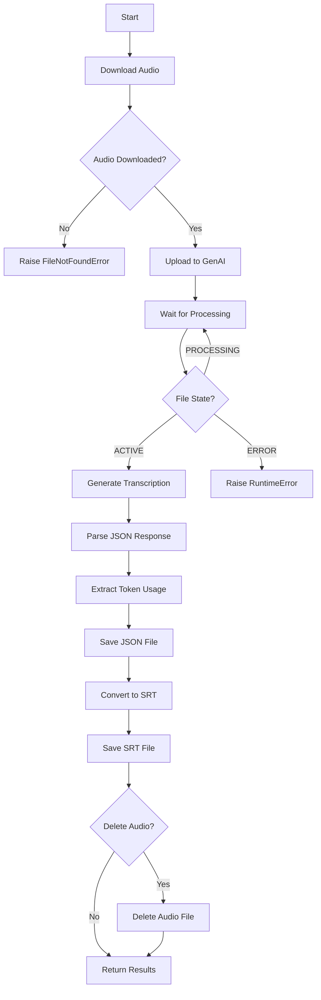
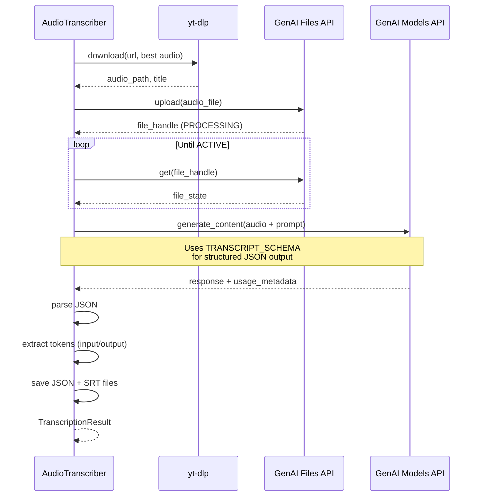

# Audio Transcriber

## Summary

Downloads audio from YouTube videos and generates timestamped transcriptions using Google's Gemini API. Outputs structured JSON with speaker identification and SRT subtitle files for direct video synchronization.

## Command Line Usage

```bash
python -m src.ingestion.audio_transcriber [OPTIONS]
```

### Arguments

| Argument | Type | Default | Description |
|----------|------|---------|-------------|
| `--url` | string | (required) | YouTube video URL to transcribe |
| `--output` | path | auto-generated | Base output path for transcription files |
| `--audio-dir` | path | `data/audio` | Directory for audio and transcript files |
| `--model` | string | `gemini-2.5-flash` | Gemini model for transcription |
| `--delete-audio` | flag | `false` | Delete audio file after transcription |

### Environment Variables

| Variable | Required | Description |
|----------|----------|-------------|
| `GOOGLE_API_KEY` | Yes | Google API key with Gemini access |

### Examples

```bash
# Transcribe a single video
python -m src.ingestion.audio_transcriber --url "https://youtube.com/watch?v=xxx"

# Use a different model and clean up audio
python -m src.ingestion.audio_transcriber --url "URL" --model gemini-2.5-pro --delete-audio

# Specify custom output location
python -m src.ingestion.audio_transcriber --url "URL" --output data/custom/video_name
```

## Business Description

### Purpose

The Audio Transcriber provides single-video transcription with high-quality, timestamped output. It handles:

1. **Audio extraction** from YouTube using best available quality
2. **Asynchronous file upload** to Google's GenAI service
3. **Structured transcription** with speaker diarization and language detection
4. **Dual-format output** (JSON for processing, SRT for playback)
5. **Token tracking** for API cost management

### Key Components

| Component | Responsibility |
|-----------|---------------|
| `TranscriberConfig` | Configuration for audio directory and model selection |
| `TranscriptionResult` | Container for transcription data and token usage stats |
| `AudioTranscriber` | Main class handling download, transcription, and output |
| `TRANSCRIPT_SCHEMA` | JSON schema enforcing structured Gemini output |

### Output Format

#### JSON Structure

```json
{
  "segments": [
    {
      "start_time": "00:00:05,120",
      "end_time": "00:00:12,450",
      "speaker": "Speaker 1",
      "language": "en",
      "content": "Transcribed text here..."
    }
  ]
}
```

#### SRT Format

```
1
00:00:05,120 --> 00:00:12,450
[Speaker 1] Transcribed text here...

2
00:00:12,450 --> 00:00:18,300
[Speaker 1] Next segment...
```

### Supported Audio Formats

| Extension | MIME Type |
|-----------|-----------|
| `.mp3` | audio/mpeg |
| `.m4a` | audio/mp4 |
| `.webm` | audio/webm |
| `.opus` | audio/opus |
| `.ogg` | audio/ogg |
| `.wav` | audio/wav |

### External Dependencies

| Dependency | Usage |
|------------|-------|
| `yt-dlp` | Audio download with format selection |
| `google-genai` | Gemini API client for transcription |

## Transcription Flow



## Gemini API Interaction



## Transcription Prompt

The transcriber uses a detailed prompt to ensure quality output:

```
Generate a detailed verbatim transcript of this audio.

Requirements:
- Transcribe all spoken words exactly as said (no paraphrasing)
- Preserve the original language (do not translate)
- Identify different speakers (use "Speaker 1", "Speaker 2", etc.)
- Detect the language of each segment
- Provide timestamps in HH:MM:SS,mmm format (SRT compatible)
- Create segments of 5-10 seconds each
```

## Token Estimation

Audio tokens are approximately 32 tokens per second of audio. A 1-hour video would use roughly:

- **Audio input tokens**: ~115,200 tokens (3,600s x 32)
- **Estimated cost** (gemini-2.5-flash): ~$0.12

Use `count_audio_tokens()` for precise pre-calculation.
