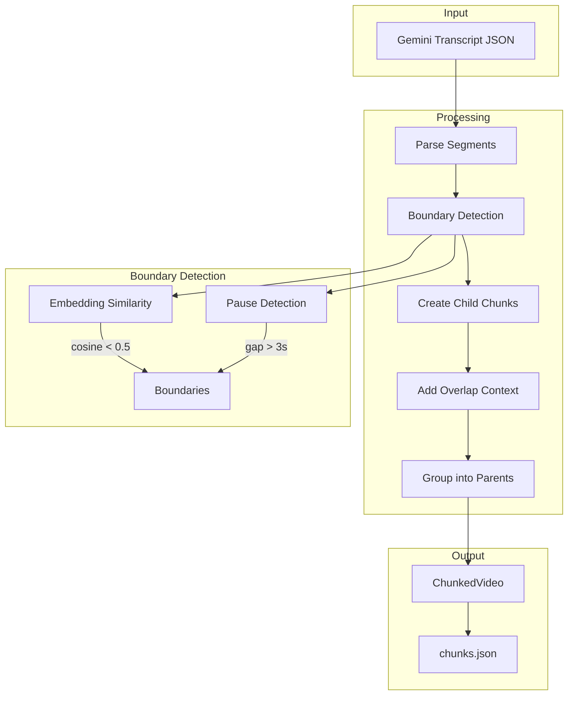
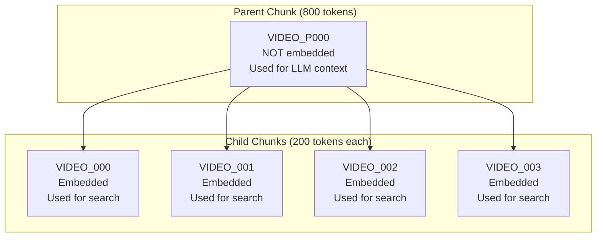
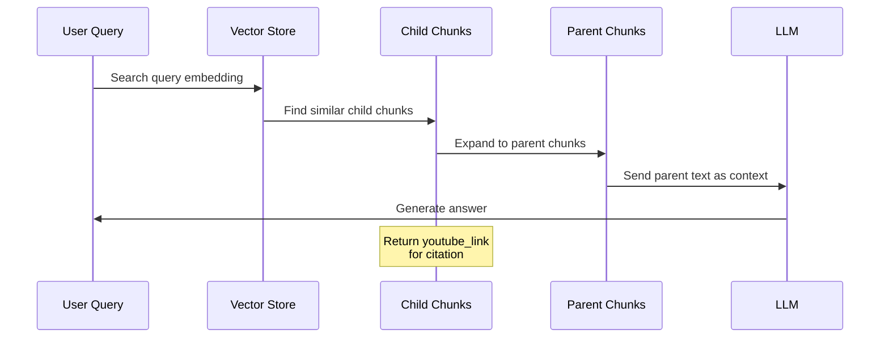
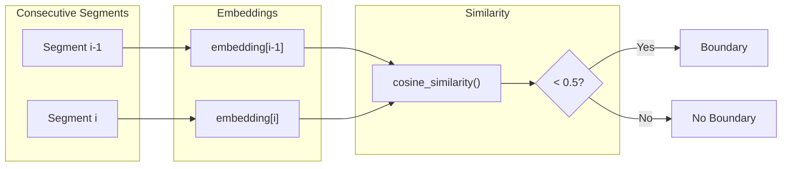
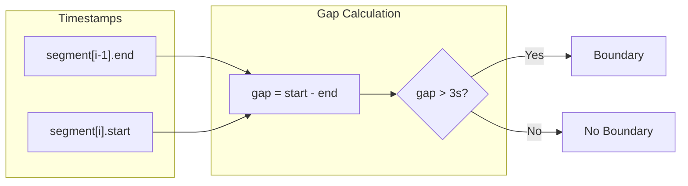
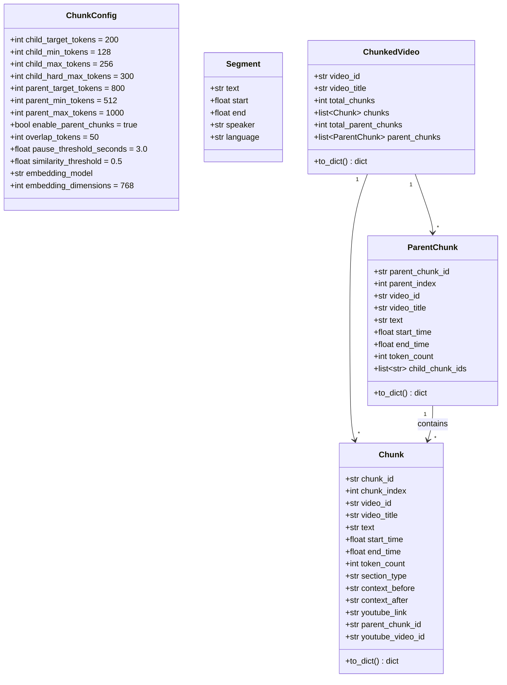
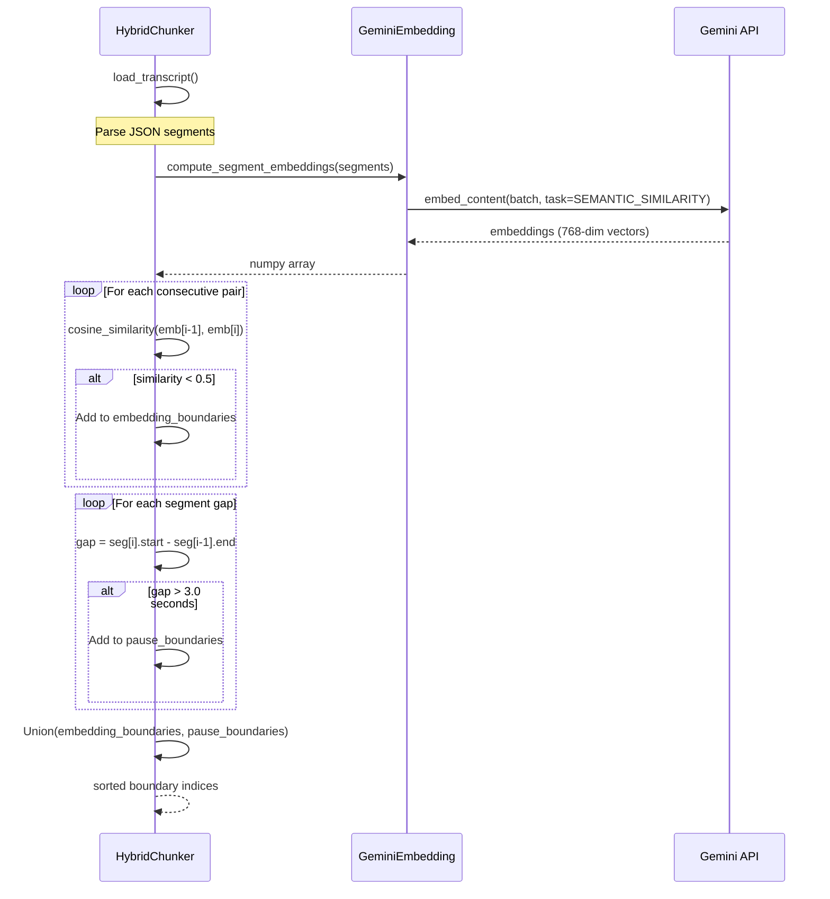
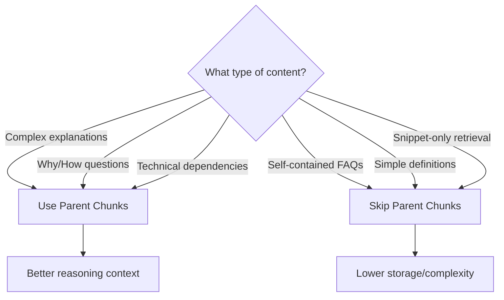

# Hybrid Chunker

## Summary

Splits YouTube transcripts into semantically coherent chunks optimized for RAG retrieval. Uses a hybrid boundary detection strategy combining Gemini embeddings (semantic similarity) with temporal pause detection to find natural split points, creating a two-tier parent-child chunk hierarchy.

## Architecture Overview



## Command Line Usage

```bash
python -m src.ingestion.chunker [OPTIONS]
```

### Arguments

| Argument | Type | Default | Description |
|----------|------|---------|-------------|
| `--input` | path | - | Single transcript JSON file to process |
| `--input-dir` | path | `data/audio` | Directory of transcript files |
| `--output-dir` | path | `data/chunks` | Output directory for chunked data |
| `--batch` | flag | `false` | Process all transcripts in input-dir |
| `--child-target-tokens` | int | `200` | Target tokens per child chunk |
| `--child-min-tokens` | int | `128` | Minimum tokens per child chunk |
| `--child-max-tokens` | int | `256` | Maximum tokens per child chunk |
| `--parent-target-tokens` | int | `800` | Target tokens per parent chunk |
| `--parent-min-tokens` | int | `512` | Minimum tokens per parent chunk |
| `--parent-max-tokens` | int | `1000` | Maximum tokens per parent chunk |
| `--no-parent-chunks` | flag | `false` | Disable parent chunk generation |
| `--similarity-threshold` | float | `0.5` | Cosine similarity threshold for boundaries |

### Examples

```bash
# Chunk a single transcript
python -m src.ingestion.chunker --input data/audio/video.json --output-dir data/chunks/

# Batch process all transcripts
python -m src.ingestion.chunker --batch --input-dir data/audio/ --output-dir data/chunks/

# Custom chunk sizes for longer content
python -m src.ingestion.chunker --batch --child-target-tokens 300 --parent-target-tokens 1200

# Skip parent chunks (only create child chunks)
python -m src.ingestion.chunker --batch --no-parent-chunks
```

## Business Description

### Purpose

The Hybrid Chunker prepares transcripts for semantic search by creating appropriately-sized text chunks. It addresses the challenge of splitting continuous speech into meaningful retrieval units by:

1. **Detecting semantic boundaries** via embedding cosine similarity
2. **Detecting temporal boundaries** via audio pause gaps (3+ seconds)
3. **Respecting continuation patterns** to avoid mid-sentence splits
4. **Creating two-tier hierarchy** for search precision + LLM context
5. **Adding overlap context** for better retrieval accuracy

## Parent-Child Hierarchy

The chunker implements a two-level hierarchy optimized for RAG:



| Layer | Token Range | Purpose | Embedded? |
|-------|-------------|---------|-----------|
| **Parent** | 512-1000 | LLM context expansion | No |
| **Child** | 128-256 | Vector search | Yes |

When a search matches a child chunk, the corresponding parent chunk is retrieved to provide the LLM with surrounding context.

## RAG Retrieval Workflow



## Key Components

| Component | Responsibility |
|-----------|---------------|
| `ChunkConfig` | Configuration for token limits and thresholds |
| `Segment` | Single utterance from transcript JSON |
| `Chunk` | Child chunk with embedding-ready text |
| `ParentChunk` | Context container grouping multiple children |
| `ChunkedVideo` | Complete result with both chunk tiers |
| `GeminiEmbedding` | Wrapper for batch embedding computation |
| `HybridChunker` | Main algorithm orchestrating all operations |

## Continuation Patterns

The chunker recognizes linguistic patterns that indicate a segment should stay with the previous chunk:

| Category | Patterns (EN/FR) |
|----------|------------------|
| Examples | "For example", "Par exemple", "For instance", "Prenons" |
| Clarification | "That is", "C'est-à-dire", "In other words", "Autrement dit" |
| Consequence | "So", "Donc", "Therefore", "Thus", "Alors" |
| Addition | "And", "Et", "Furthermore", "De plus", "Also", "En plus" |
| Contrast | "But", "Mais", "However", "Cependant", "Toutefois" |
| Cause | "Because", "Parce que", "Car", "Since", "Puisque" |
| Reference | "This", "Cette", "Which", "Ce qui", "That", "Cela", "Ça" |
| Lists | "1.", "2.", "Second", "Deuxièmement", "Troisièmement", "Ensuite", "Puis" |
| Demonstration | "Here", "Ici", "Voici", "Look", "Regardez", "On voit" |
| Continuation | "Actually", "En fait", "Moreover", "D'ailleurs" |

## Output JSON Structure

```json
{
  "video_id": "abc123",
  "video_title": "Introduction to RAG",
  "total_chunks": 20,
  "total_parent_chunks": 5,
  "parent_chunks": [
    {
      "parent_chunk_id": "abc123_P000",
      "parent_index": 0,
      "video_id": "abc123",
      "video_title": "Introduction to RAG",
      "text": "Combined text from all children (~800 tokens)...",
      "start_time": 0.0,
      "end_time": 120.5,
      "token_count": 812,
      "child_chunk_ids": ["abc123_000", "abc123_001", "abc123_002", "abc123_003"]
    }
  ],
  "chunks": [
    {
      "chunk_id": "abc123_000",
      "chunk_index": 0,
      "video_id": "abc123",
      "video_title": "Introduction to RAG",
      "text": "Individual chunk text (~200 tokens)...",
      "start_time": 0.0,
      "end_time": 30.2,
      "token_count": 195,
      "section_type": "main_content",
      "youtube_link": "https://youtube.com/watch?v=abc123&t=0s",
      "parent_chunk_id": "abc123_P000",
      "context_before": "",
      "context_after": "...last 50 tokens of next chunk..."
    }
  ]
}
```

## External Dependencies

| Dependency | Usage |
|------------|-------|
| `google-genai` | Embedding computation via gemini-embedding-001 |
| `numpy` | Cosine similarity calculations |

## Chunking Algorithm

```mermaid
flowchart TD
    START([Start]) --> LOAD[Load transcript segments]
    LOAD --> DETECT[Detect boundaries<br/>embeddings + pauses]
    DETECT --> INIT[Initialize: chunks=[], tokens=0]

    INIT --> LOOP{For each segment}

    LOOP --> CHECK{Would exceed<br/>max tokens?}

    CHECK -->|Yes| MIN{tokens >= min?}
    MIN -->|Yes| CONT{Is continuation<br/>pattern?}
    CONT -->|Yes| HARD{tokens <= hard_max?}
    HARD -->|Yes| ADD[Add to current chunk]
    HARD -->|No| SPLIT[Create chunk, reset]
    CONT -->|No| SPLIT
    MIN -->|No| ADD

    CHECK -->|No| TARGET{tokens >= target<br/>AND at boundary?}
    TARGET -->|Yes| SPLIT
    TARGET -->|No| ADD

    ADD --> LOOP
    SPLIT --> LOOP

    LOOP -->|Done| OVERLAP[Add overlap context]
    OVERLAP --> PARENT{Parent chunks<br/>enabled?}
    PARENT -->|Yes| GROUP[Group into parents]
    PARENT -->|No| OUTPUT
    GROUP --> OUTPUT[Return ChunkedVideo]
    OUTPUT --> END([End])
```

## Boundary Detection

The chunker uses two complementary signals to detect natural chunk boundaries:

### Semantic Boundaries (Embedding-based)



### Temporal Boundaries (Pause-based)



## Chunk Data Model



## Boundary Detection Sequence



## Configuration Reference

| Parameter | Default | Description |
|-----------|---------|-------------|
| `child_target_tokens` | 200 | Target size for child chunks |
| `child_min_tokens` | 128 | Minimum child chunk size |
| `child_max_tokens` | 256 | Maximum child chunk size |
| `child_hard_max_tokens` | 300 | Hard max (allows continuations) |
| `parent_target_tokens` | 800 | Target size for parent chunks |
| `parent_min_tokens` | 512 | Minimum parent chunk size |
| `parent_max_tokens` | 1000 | Maximum parent chunk size |
| `enable_parent_chunks` | true | Enable parent chunk generation |
| `overlap_tokens` | 50 | Context overlap between chunks |
| `pause_threshold_seconds` | 3.0 | Gap duration for pause boundary |
| `similarity_threshold` | 0.5 | Cosine similarity for boundary |
| `embedding_model` | gemini-embedding-001 | Embedding model |
| `embedding_dimensions` | 768 | Embedding vector dimensions |

## Token Estimation

The chunker uses a heuristic: **tokens = words x 1.3**

This accounts for multilingual content where subword tokenization varies. For a 1-hour video with ~9,000 words:

- **Child chunks**: ~35-45 chunks (200 tokens each)
- **Parent chunks**: ~10-12 chunks (800 tokens each)

## When to Use Parent Chunks



## Batch Processing Output

When using `--batch`, a manifest file is created:

```json
{
  "videos": {
    "video_1": {"title": "Video 1", "chunks": 42, "parent_chunks": 12},
    "video_2": {"title": "Video 2", "chunks": 38, "parent_chunks": 10}
  },
  "total_chunks": 80,
  "total_parent_chunks": 22
}
```
