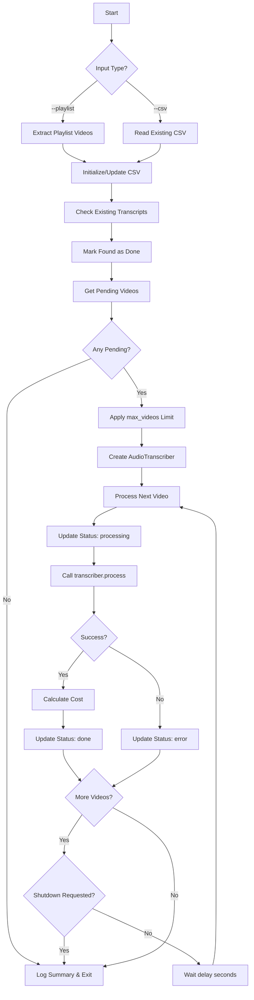
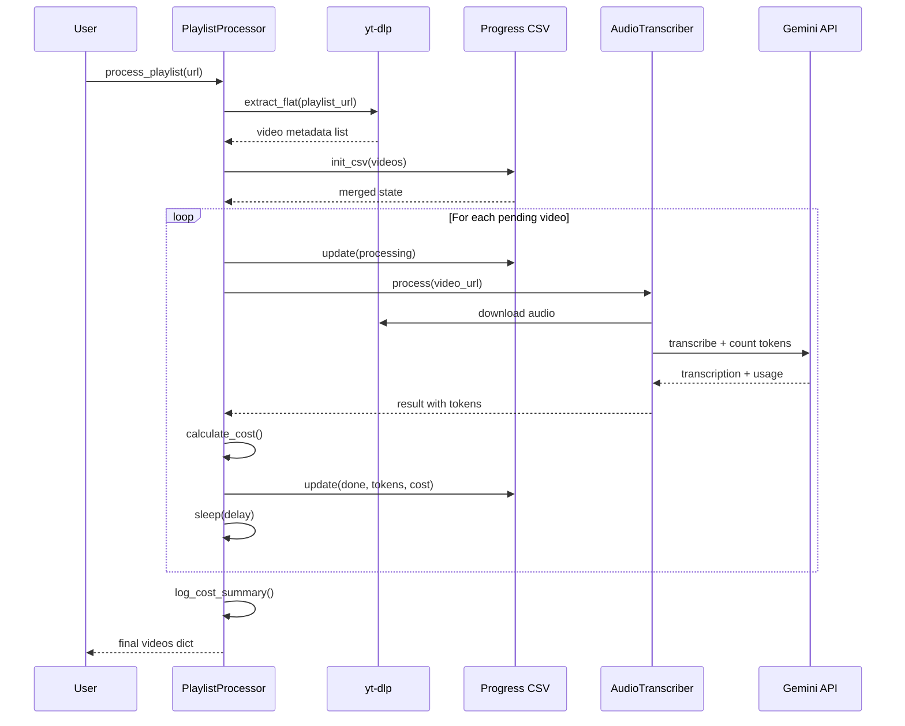

# Playlist Processor

## Summary

Orchestrates the batch processing of YouTube playlists by downloading and transcribing all videos with persistent progress tracking. Enables resumable processing through CSV state management and provides cost estimation for Gemini API usage.

## Command Line Usage

```bash
python -m src.ingestion.playlist_processor [OPTIONS]
```

### Arguments

| Argument | Type | Default | Description |
|----------|------|---------|-------------|
| `--playlist` | string | (required*) | YouTube playlist URL to process |
| `--csv` | path | (required*) | Resume from existing CSV file (mutually exclusive with --playlist) |
| `--audio-dir` | path | `data/audio` | Directory for audio and transcript files |
| `--model` | string | `gemini-2.5-flash` | Gemini model for transcription |
| `--delay` | float | `2.0` | Delay between videos (seconds) |
| `--delete-audio` | flag | `false` | Delete audio files after transcription |
| `--max-videos` | int | `20` | Maximum videos per run |
| `--no-limit` | flag | `false` | Process all pending videos |

*Either `--playlist` or `--csv` is required (mutually exclusive).

### Examples

```bash
# Process a new playlist (max 20 videos)
python -m src.ingestion.playlist_processor --playlist "https://youtube.com/playlist?list=PLxxx"

# Process more videos from same playlist
python -m src.ingestion.playlist_processor --csv data/playlist_progress.csv --max-videos 50

# Process all remaining videos without limit
python -m src.ingestion.playlist_processor --csv data/playlist_progress.csv --no-limit

# Use a different model with custom delay
python -m src.ingestion.playlist_processor --playlist "URL" --model gemini-2.5-pro --delay 5.0
```

## Business Description

### Purpose

The Playlist Processor serves as the entry point for batch transcription workflows. It solves the problem of processing large YouTube playlists reliably by:

1. **Extracting video metadata** from playlists without downloading content
2. **Tracking progress** in a CSV file to enable resume after interruptions
3. **Detecting existing transcripts** to avoid redundant processing
4. **Managing API costs** with token counting and USD estimates
5. **Handling graceful shutdown** via signal handlers (SIGINT/SIGTERM)

### Key Components

| Component | Responsibility |
|-----------|---------------|
| `VideoInfo` | Data class storing video metadata, status, and cost metrics |
| `PlaylistConfig` | Configuration container for paths, model, and limits |
| `PlaylistProcessor` | Main orchestrator managing the processing loop |
| `GEMINI_PRICING` | Pricing lookup table for cost estimation |

### Processing States

Videos transition through these states:

| Status | Description |
|--------|-------------|
| `pending` | Not yet processed |
| `processing` | Currently being transcribed |
| `done` | Successfully transcribed |
| `error` | Failed with error message |

### CSV Output Format

The progress file contains these columns:

```
video_id, url, title, status, error, processed_at, input_tokens, output_tokens, cost_usd
```

### External Dependencies

| Dependency | Usage |
|------------|-------|
| `yt-dlp` | YouTube playlist metadata extraction |
| `AudioTranscriber` | Video download and Gemini transcription |

## Processing Flow



## Video Processing Sequence



## Cost Estimation

The processor tracks API costs using Gemini's pricing tiers:

| Model | Audio Input ($/1M tokens) | Output ($/1M tokens) |
|-------|--------------------------|---------------------|
| gemini-2.5-flash | $1.00 | $2.50 |
| gemini-2.0-flash | $0.70 | $0.40 |
| gemini-2.5-pro | $2.50 | $15.00 |

Costs are calculated per video and aggregated for run totals and all-time totals in the CSV.
