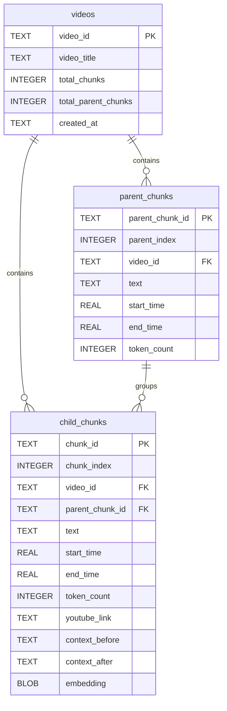
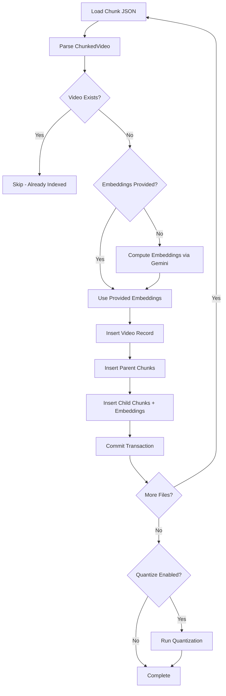
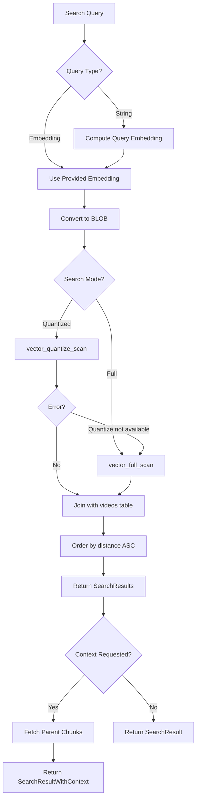
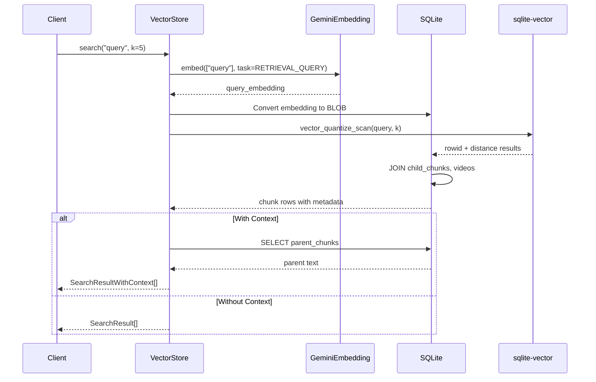

# Vector Store

## Summary

SQLite-based vector database for storing and searching YouTube transcript chunks using the sqlite-vector extension. Supports parent-child chunk hierarchy for context expansion, cosine similarity search, and optional quantization for faster approximate queries.

## Command Line Usage

```bash
python -m src.ingestion.vector_store <command> [OPTIONS]
```

### Commands

#### `ingest` - Add chunks to the database

```bash
python -m src.ingestion.vector_store ingest [OPTIONS]
```

| Argument | Type | Default | Description |
|----------|------|---------|-------------|
| `--input` | path | - | Single chunk JSON file |
| `--input-dir` | path | - | Directory of chunk files |
| `--db` | path | `data/vector_store.db` | Database path |

#### `search` - Query the vector store

```bash
python -m src.ingestion.vector_store search QUERY [OPTIONS]
```

| Argument | Type | Default | Description |
|----------|------|---------|-------------|
| `query` | string | (required) | Search query text |
| `-k` | int | `5` | Number of results |
| `--db` | path | `data/vector_store.db` | Database path |
| `--with-context` | flag | `false` | Include parent chunk context |

#### `stats` - Show database statistics

```bash
python -m src.ingestion.vector_store stats [--db PATH]
```

#### `list` - List all indexed videos

```bash
python -m src.ingestion.vector_store list [--db PATH]
```

#### `delete` - Remove a video from the store

```bash
python -m src.ingestion.vector_store delete VIDEO_ID [--db PATH]
```

### Examples

```bash
# Ingest all chunked files
python -m src.ingestion.vector_store ingest --input-dir data/chunks/

# Ingest a single file
python -m src.ingestion.vector_store ingest --input data/chunks/video_chunks.json

# Search for content
python -m src.ingestion.vector_store search "machine learning basics" -k 5

# Search with expanded parent context
python -m src.ingestion.vector_store search "how does caching work" -k 3 --with-context

# View database statistics
python -m src.ingestion.vector_store stats

# List all indexed videos
python -m src.ingestion.vector_store list

# Delete a video
python -m src.ingestion.vector_store delete my_video_id
```

## Business Description

### Purpose

The Vector Store provides semantic search over transcript chunks for RAG (Retrieval-Augmented Generation) applications. It enables:

1. **Efficient vector storage** in SQLite with the sqlite-vector extension
2. **Cosine similarity search** for finding relevant content
3. **Context expansion** via parent chunks for better LLM responses
4. **Quantized search** for faster approximate queries
5. **CRUD operations** for managing indexed videos

### Key Components

| Component | Responsibility |
|-----------|---------------|
| `VectorStoreConfig` | Database path, embedding model, quantization settings |
| `SearchResult` | Single search result with metadata |
| `SearchResultWithContext` | Search result with parent chunk text |
| `VectorStore` | Main database interface for all operations |
| `load_chunked_video()` | Deserialize ChunkedVideo from JSON |
| `ingest_chunks()` | Batch ingestion utility function |

### Search Modes

| Mode | Function | Speed | Accuracy |
|------|----------|-------|----------|
| Full Scan | `vector_full_scan` | Slower | Exact |
| Quantized | `vector_quantize_scan` | Faster | Approximate |

Quantized search is used by default after running `quantize()` on the database.

### External Dependencies

| Dependency | Usage |
|------------|-------|
| `sqlite3` | Database engine |
| `sqlite-vector` | Vector operations extension |
| `numpy` | Embedding array manipulation |
| `google-genai` | Query embedding computation |
| `chunker` module | Chunk/ParentChunk data classes |

## Database Schema



### Schema Notes

- **Foreign keys** cascade deletes from videos to chunks
- **Vector index** on `child_chunks.embedding` with COSINE distance
- **Indexes** on video_id and parent_chunk_id for faster lookups
- **Embeddings** stored as FLOAT32 BLOBs (768 dimensions x 4 bytes = 3KB per chunk)

## Ingestion Flow



## Search Flow



## Search Sequence



## Vector Index Configuration

The vector index is initialized with:

```sql
SELECT vector_init('child_chunks', 'embedding',
    'dimension=768,type=FLOAT32,distance=COSINE')
```

| Parameter | Value | Description |
|-----------|-------|-------------|
| dimension | 768 | Gemini embedding dimensions |
| type | FLOAT32 | 32-bit floating point |
| distance | COSINE | Similarity metric (0=identical, 2=opposite) |

## Storage Estimates

For a playlist with 100 videos averaging 40 chunks each:

| Component | Calculation | Size |
|-----------|-------------|------|
| Child chunks | 4,000 x 3KB embedding | ~12 MB |
| Text content | 4,000 x ~1KB avg | ~4 MB |
| Parent chunks | 1,000 x ~3KB text | ~3 MB |
| Indexes | ~10% overhead | ~2 MB |
| **Total** | | **~21 MB** |

## Search Output Example

```
Search: "how does the API handle errors"

1. [0.234] Video Title Here (12:45)
   https://www.youtube.com/watch?v=xxx&t=765s
   "When the API encounters an error, it returns a structured response with..."

2. [0.287] Another Video (5:30)
   https://www.youtube.com/watch?v=yyy&t=330s
   "Error handling is implemented at multiple layers. First, we validate..."
```

The distance score (0.0-2.0) indicates similarity:
- **0.0-0.3**: Highly relevant
- **0.3-0.6**: Moderately relevant
- **0.6+**: Loosely related
